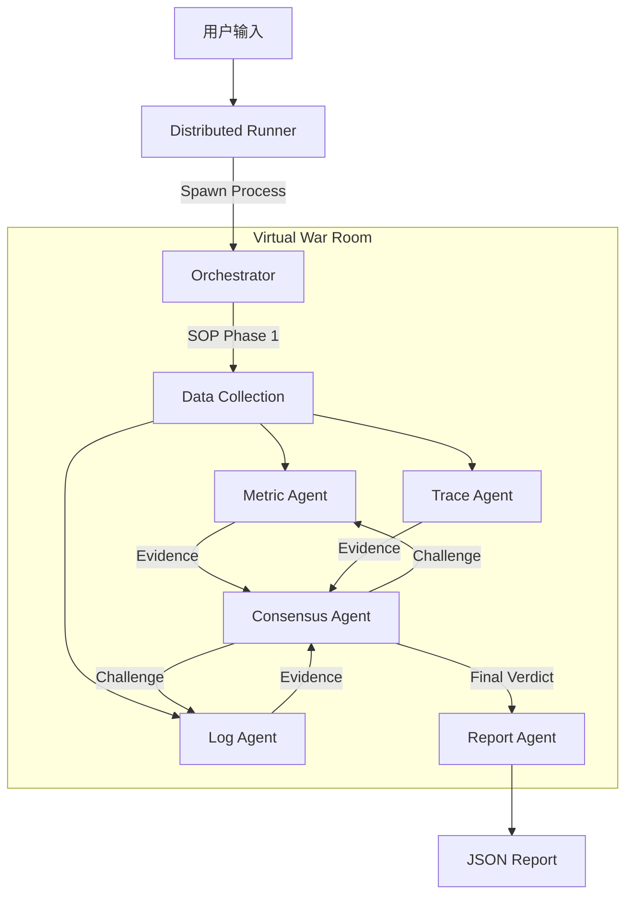

# Context-RCA: Multi-Agent Root Cause Analysis System

Context-RCA 是一个基于大语言模型（LLM）和多智能体协作（Multi-Agent Collaboration）架构的微服务故障根因分析系统。它模拟了一支由资深 SRE 专家组成的“虚拟作战室”，通过严谨的 SOP（标准作业程序）和多轮辩论机制，自动化完成从现象发现、证据搜集到根因定性的全过程。

## 🌟 核心设计亮点 (Design Philosophy)

### 1. 专家委员会机制 (Committee of Experts)
不同于单一 Agent 的“全能模式”，我们设计了专职专责的专家角色：
- **Metric Agent (指标专家)**: 专注于时序数据分析，擅长识别 `latency_spike` (延迟突增) 和 `error_ratio` (错误率) 异常，并能区分 Pod 重启 (`pod_processes`) 导致的次生灾害。
- **Log Agent (日志专家)**: 深入日志堆栈，精准定位 `Error`、`Exception` 及关键的业务报错信息。
- **Trace Agent (链路专家)**: 追踪分布式调用链，识别关键路径上的瓶颈服务。
- **Consensus Agent (决策主席)**: 扮演“法官”角色，不直接处理原始数据，而是综合各方专家的“证词”，通过交叉验证（Cross-Validation）排除幻觉，形成最终判决。

### 2. 证据驱动的推理 (Evidence-Based Reasoning)
系统拒绝“猜测”。所有的结论必须建立在确凿的证据链之上：
- **多模态对齐**: 只有当 Metric 显示异常且 Log/Trace 提供佐证时，才会被认定为根因。
- **因果链构建**: 能够识别“因”与“果”，例如：准确识别出 *CartService 的高延迟* 实际上是由 *ShippingService 的 Pod 重启* 引起的，从而避免误报。

### 3. 鲁棒的分布式执行架构 (Robust Distributed Execution)
为了应对大规模数据集的评测需求，我们设计了基于进程隔离的分布式运行器：
- **进程级隔离**: 每个 Case 独立运行，互不干扰，彻底解决 LLM API 并发导致的线程安全问题。
- **断点续传**: 支持失败重试和增量运行。
- **实时监控**: 内置进度条与 ETA 预估，实时掌握大规模评测进度。

## 🏗️ 系统架构



## 🚀 快速开始

### 1. 环境准备

本项目使用 `uv` 进行依赖管理，确保环境纯净。

```bash
# 安装依赖
uv sync

# 激活环境
source .venv/bin/activate
```

### 2. 配置

在项目根目录创建 `.env` 文件：

```bash
OPENAI_API_KEY="sk-..."
# 其他 LLM 相关配置
```

### 3. 运行指南

#### 场景 A: 生产级批量评测 (推荐)
使用我们全新设计的分布式运行器，稳定、高效地运行大规模测试集。

```bash
# 运行 input/failures_retest.json 中的所有案例
# 结果输出到 output/retest_result_final.jsonl
# 开启 10 个并发进程
python run_distributed.py \
    --input input/failures_retest.json \
    --output output/retest_result_final.jsonl \
    --workers 10 \
    --log-base logs_retest
```
*特性：自动进度条、日志自动归档、支持 Ctrl+C 优雅退出。*

#### 场景 B: 单个案例调试
开发调试时，使用 `main.py` 快速运行单个 Case。

```bash
# 运行指定 UUID 的案例
python main.py --single "31392fda-93-..."

# 或者运行列表中的第 N 个案例
python main.py --single 1
```

## 📊 输出示例

系统最终输出标准的 JSONL 格式，包含核心根因结论与完整的推理过程：

```json
{
  "root_cause": "shippingservice",
  "fault_type": "pod_restart",
  "reasoning": "Metric Agent detected a restart in shippingservice-0 (pod_processes drop). Log Agent confirmed startup logs at the same timestamp. Although CartService showed high latency, it was identified as a downstream effect...",
  "score": { ... }
}
```

---
*Designed for SREs, by AI Agents.*
