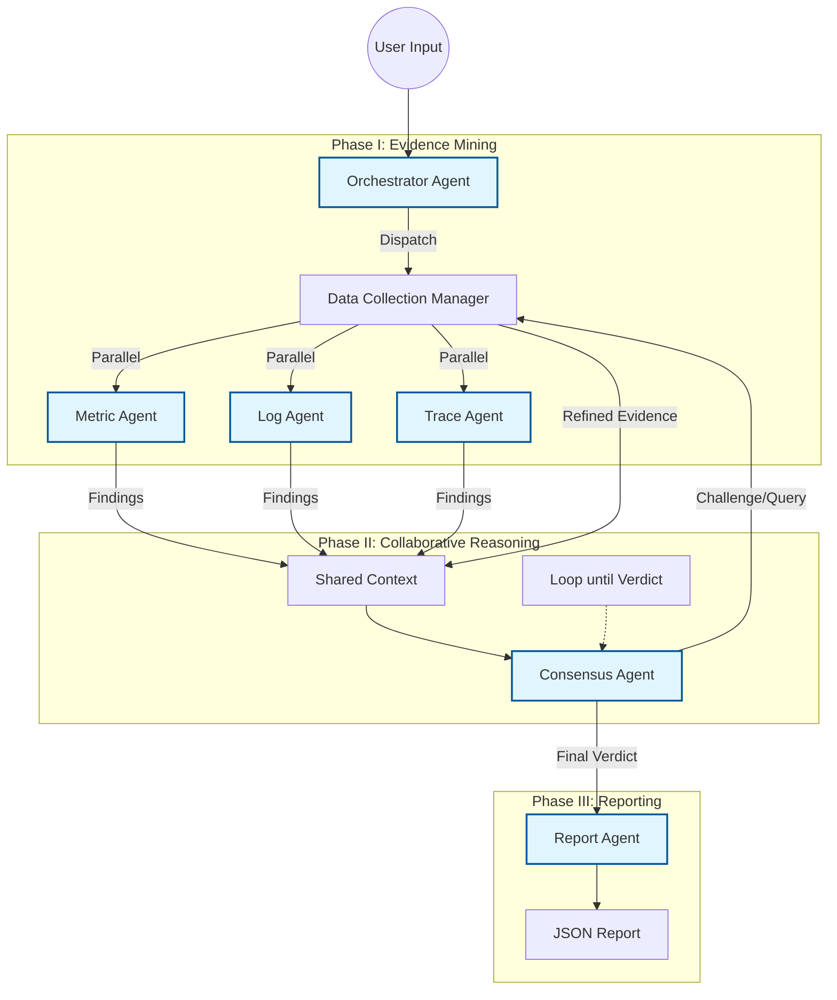

# Context-RCA: Multi-Agent Root Cause Analysis System

Context-RCA 是一个基于大语言模型（LLM）和多智能体协作（Multi-Agent Collaboration）架构的微服务故障根因分析系统。它模拟了一支由资深 SRE 专家组成的“虚拟作战室”，通过严谨的 SOP（标准作业程序）和多轮辩论机制，自动化完成从现象发现、证据搜集到根因定性的全过程。

## 系统架构与方法论 (System Architecture & Methodology)

我们提出了一种四层架构，旨在将执行关注点与认知推理分离，模拟人类作战室的协作模式。

### 1. 架构分层 (Layered Architecture)

*   **Orchestration Layer (编排层)**:
    *   **Orchestrator Agent**: 作为中央状态机，强制执行标准作业程序 (SOP)。它负责解析用户查询 (`parse_user_input`) 并管理分析会话的全生命周期，确保数据流在各阶段间的正确流转。
*   **Expert Layer (专家层)**:
    *   **Metric Agent**: 专注于时序数据分析，识别延迟突增、错误率异常，并区分 Pod 级与 Node 级资源争用。
    *   **Log Agent**: 分析结构化与非结构化日志，定位异常堆栈与关键错误模式（如 DNS 失败）。
    *   **Trace Agent**: 基于分布式追踪数据构建服务依赖图，定位瓶颈服务与故障传播路径。
*   **Reasoning Layer (推理层)**:
    *   **Consensus Agent & Iterative Loop**: 系统的核心引擎。它不直接处理原始数据，而是作为“法官”评估专家层的证词。通过**挑战-应答 (Challenge-Response)** 机制和多轮迭代（最多 6 轮），解决跨模态的证据冲突（例如指标与日志的归因不一致）。
*   **Reporting Layer (报告层)**:
    *   **Report Agent**: 将最终达成的共识综合为结构化的诊断报告，包含根因、证据链及影响范围。

### 2. 诊断工作流 (Diagnosis Workflow)

分析过程遵循严格的 **三阶段 SOP (Three-Phase SOP)**：

*   **Phase I: 多视角证据挖掘 (Multi-View Evidence Mining)**
    Orchestrator 调度 **Data Collection Agent** 并行启动三位领域专家 (Metric, Log, Trace)。各专家独立从各自的数据源中提取“局部证据”和异常发现。
*   **Phase II: 协作推理与共识 (Collaborative Reasoning)**
    **Consensus Discussion Agent** 启动辩论循环：
    1.  **假设生成**: 基于聚合的发现提出初始假设 $H_0$。
    2.  **交叉验证**: 检查证据对齐情况（例如：网络故障假设需要 Metric 的丢包数据与 Log 的连接超时同时存在）。
    3.  **冲突解决**: 当专家意见不一致时（如 Node 故障 vs Pod 故障），触发特定的**模式匹配 (Pattern Matching)** 逻辑进行裁决。
    4.  循环直至达成 `AGREED` 状态或达到最大轮次。
*   **Phase III: 最终裁决报告 (Verdict & Reporting)**
    Orchestrator 将最终共识上下文传递给 Report Agent，生成人类可读的最终报告。



### 3. 方法论亮点 (Key Methodology)

*   **专家知识注入 (Expert Knowledge Injection)**
    系统不完全依赖 LLM 的概率推理，而是在 Consensus Agent 中注入了显式的 **故障模式 (Fault Patterns)**（如 DNS 故障特征、Node vs Pod 资源归因逻辑），显著减少了幻觉。
*   **证据驱动裁决 (Evidence-Driven Adjudication)**
    **多模态对齐 (Multi-modal Alignment)**：任何因果结论都必须在至少两个模态（如 Metric + Log）中得到相互印证才会被最终采纳。

## 🚀 快速开始

### 1. 环境准备

本项目使用 `uv` 进行依赖管理，确保环境纯净。

```bash
# 安装依赖
uv sync

# 激活环境
source .venv/bin/activate
```

### 2. 配置

在项目根目录创建 `.env` 文件：

```bash
OPENAI_API_KEY="sk-..."
# 其他 LLM 相关配置
```

### 3. 运行指南

#### 场景 A: 生产级批量评测 (推荐)
使用我们全新设计的分布式运行器，稳定、高效地运行大规模测试集。

```bash
# 运行 input/failures_retest.json 中的所有案例
# 结果输出到 output/retest_result_final.jsonl
# 开启 10 个并发进程
python run_distributed.py \
    --input input/failures_retest.json \
    --output output/retest_result_final.jsonl \
    --workers 10 \
    --log-base logs_retest
```
*特性：自动进度条、日志自动归档、支持 Ctrl+C 优雅退出。*

#### 场景 B: 单个案例调试
开发调试时，使用 `main.py` 快速运行单个 Case。

```bash
# 运行指定 UUID 的案例
python main.py --single "31392fda-93-..."

# 或者运行列表中的第 N 个案例
python main.py --single 1
```

## 📊 输出示例

系统最终输出标准的 JSONL 格式，包含核心根因结论与完整的推理过程：

```json
{
  "root_cause": "shippingservice",
  "fault_type": "pod_restart",
  "reasoning": "Metric Agent detected a restart in shippingservice-0 (pod_processes drop). Log Agent confirmed startup logs at the same timestamp. Although CartService showed high latency, it was identified as a downstream effect...",
  "score": { ... }
}
```

